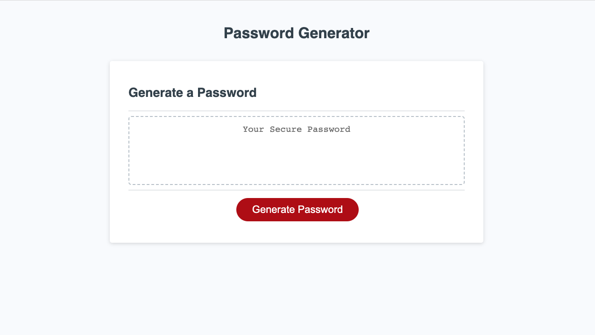

# ch05-password-generator
Demonstration of JS skills, using functions and iteration methods. 

## Description 

This program generates a randomised password, based on the users response to a series of prompts. 

### Motivation 
This project expands my understanding of javascript, and introduces fundemental elements of the program such as functions. 

### What does this solve. 
Well, I will never have to think of a password my again. 

### What I have learnt 
Became more confortable with declaring and calling functions. 
How to interconnect and call funcation within functions. 
To always create the MVP, before refactoring or improving code. 

## Visual of the program

```md

```


